<div align="center">

# 🤖 Upwork-AI-Applier
### *Your AI-Powered Freelance Career Accelerator*

[](https://www.python.org/downloads/)
[](https://python.langchain.com/)
[](https://www.docker.com/)
[](LICENSE)

**Transform your freelancing game with AI! 🚀**  
*Automatically discover, score, and apply to perfect-match Upwork jobs while you sleep*

</div>

---

## 🎯 The Freelancer's Dilemma

<table>
<tr>
<td width="50%">

### 😩 The Problem
- **Hours wasted** scrolling through job listings
- **Proposal fatigue** from repetitive applications  
- **Missed opportunities** while you sleep
- **Generic applications** that don't stand out
- **Inconsistent income** from hit-or-miss approach

</td>
<td width="50%">

### ✨ The Solution
- **AI-powered job discovery** that works 24/7
- **Smart scoring system** finds perfect matches
- **Personalized cover letters** for every application
- **Interview prep materials** included automatically
- **Consistent pipeline** of high-quality opportunities

</td>
</tr>
</table>

## 🚀 Why Upwork-AI-Applier?

<div align="center">

### *Your AI-Powered Freelance Assistant That Never Sleeps*

</div>

<table>
<tr>
<td align="center" width="33%">

### 🎯 Smart Discovery
**Intelligent Job Scanning**  
Automatically finds and scores job opportunities based on your skills, experience, and preferences

</td>
<td align="center" width="33%">

### ✍️ Personalized Content
**AI-Generated Applications**  
Creates tailored cover letters and interview prep materials that showcase your unique value

</td>
<td align="center" width="33%">

### 🔄 24/7 Automation
**Never Miss an Opportunity**  
Works around the clock to ensure you're first in line for the best projects

</td>
</tr>
</table>

### 🎨 Key Features

- 🔍 **Smart Job Discovery**: AI scans Upwork for opportunities matching your profile
- 📊 **Intelligent Scoring**: Only jobs scoring 7/10+ make it to your pipeline  
- 📝 **Custom Cover Letters**: Tailored applications that highlight your relevant experience
- 🎤 **Interview Prep**: Get ready with AI-generated questions and talking points
- 💰 **Cost-Effective**: Powerful automation at freelancer-friendly pricing
- 🔄 **Multi-LLM Support**: Works with OpenAI, Claude, Gemini, and Groq

## 🔧 How It Works

<div align="center">

### *From Job Search to Interview-Ready in Minutes*

```mermaid
graph TD
    A[🔍 Job Search] --> B[🎯 Smart Filtering]
    B --> C[📊 AI Scoring]
    C --> D[✍️ Cover Letter Generation]
    D --> E[🎤 Interview Prep]
    E --> F[💾 Ready to Apply]
    
    style A fill:#e1f5fe,stroke:#0277bd,stroke-width:2px,color:#000
    style B fill:#f3e5f5,stroke:#7b1fa2,stroke-width:2px,color:#000
    style C fill:#e8f5e8,stroke:#388e3c,stroke-width:2px,color:#000
    style D fill:#fff3e0,stroke:#f57c00,stroke-width:2px,color:#000
    style E fill:#fce4ec,stroke:#c2185b,stroke-width:2px,color:#000
    style F fill:#e0f2f1,stroke:#00796b,stroke-width:2px,color:#000
```

</div>



### 🎯 Core Features

<table>
<tr>
<td width="50%">

#### 🔍 **Smart Job Discovery**
- Real-time Upwork monitoring for your target roles
- Advanced filtering based on your profile and preferences  
- Automatic duplicate detection and database storage
- Continuous background scanning (24/7 operation)

</td>
<td width="50%">

#### 📊 **Intelligent Scoring System**
- Multi-factor job evaluation (skills, budget, client history)
- Machine learning-based compatibility scoring
- Only 7/10+ jobs proceed to application generation
- Transparent scoring criteria you can customize

</td>
</tr>
<tr>
<td width="50%">

#### ✍️ **AI-Powered Content Creation**
- Dynamic cover letter generation for each opportunity
- Personalized content matching your writing style
- Keyword optimization for better client engagement
- Professional formatting and structure

</td>
<td width="50%">

#### 🎤 **Interview Preparation Suite**
- Job-specific interview questions and talking points
- Strategic response frameworks and examples
- Client background research and insights
- Confidence-building preparation materials

</td>
</tr>
</table>

---

## 🛠️ Tech Stack

<div align="center">

### *Built with Modern AI and Automation Tools*

</div>

<table>
<tr>
<td align="center" width="25%">


**Core Language**  
*Python 3.9+*

</td>
<td align="center" width="25%">


**AI Framework**  
*LangChain & LangGraph*

</td>
<td align="center" width="25%">


**Web Automation**  
*Playwright*

</td>
<td align="center" width="25%">


**Database**  
*SQLite*

</td>
</tr>
</table>

#### 🤖 **AI Models Supported**
- **OpenAI** (GPT-4, GPT-3.5-turbo) - Default recommendation
- **Google** (Gemini Pro) - For advanced reasoning
- **Anthropic** (Claude) - For creative writing
- **Groq** (Llama 3) - For fast inference

#### 🔧 **Additional Tools**
- **LangSmith** - AI workflow monitoring and debugging
- **Docker** - Containerized deployment
- **BeautifulSoup** - HTML parsing and content extraction

---

## 🚀 Quick Start

<div align="center">

### *Get Up and Running in Under 5 Minutes*

</div>

### 📋 Prerequisites

<table>
<tr>
<td align="center" width="33%">

🐍 **Python 3.9+**  
*Required for running the application*

</td>
<td align="center" width="33%">

🔑 **API Keys**  
*At least one LLM provider key*

</td>
<td align="center" width="33%">

🐳 **Docker** *(Optional)*  
*For containerized deployment*

</td>
</tr>
</table>

### 🛠️ Installation

1. **Clone the repository:**

   ```bash
   git clone https://github.com/tuankg1028/Upwork-AI-Applier.git
   cd Upwork-AI-Applier
   ```

2. **Set up environment variables:**

   ```bash
   cp .env.example .env
   # Edit .env with your API keys
   ```

3. **Create virtual environment:**

   ```bash
   python -m venv venv
   source venv/bin/activate  # Windows: venv\Scripts\activate
   ```

4. **Install dependencies:**

   ```bash
   pip install -r requirements.txt
   playwright install firefox
   ```

5. **Configure your profile:**

   ```bash
   # Edit files/profile.md with your freelancer information
   nano files/profile.md
   ```

### 🎯 Running the Application

#### Option 1: Full Automation
```bash
python main.py
```
*Runs the complete workflow: scraping → scoring → cover letter generation*

#### Option 2: Test Scraping Only
```bash
python scrape_upwork_jobs.py
```
*Just tests the job scraping functionality*

### 📊 What Happens Next?

<table>
<tr>
<td width="50%">

**🔍 Job Discovery**
- Scans Upwork for your target roles
- Filters and scores opportunities
- Saves results to SQLite database

</td>
<td width="50%">

**📝 Content Generation**
- Creates personalized cover letters
- Generates interview preparation materials
- Saves everything to `data/cover_letter.md`

</td>
</tr>
</table>

---

## 🐳 Docker Deployment

<div align="center">

### *One-Click Deployment with Docker*

</div>

Perfect for production environments or if you prefer containerized applications.

### 🚀 Quick Docker Setup

1. **Build the container:**
   ```bash
   docker build -t upwork-ai-applier .
   ```

2. **Run with environment variables:**
   ```bash
   docker run -e OPENAI_API_KEY=your_key_here \
              -v ./data:/app/data \
              upwork-ai-applier
   ```

3. **Test scraping only:**
   ```bash
   docker run -e OPENAI_API_KEY=your_key_here \
              -v ./data:/app/data \
              upwork-ai-applier python scrape_upwork_jobs.py
   ```

### 🔧 Environment Variables for Docker

```bash
# Required
OPENAI_API_KEY=your_openai_key

# Optional (for other LLM providers)
GOOGLE_API_KEY=your_google_key
GROQ_API_KEY=your_groq_key
LANGCHAIN_API_KEY=your_langsmith_key
```

---

## 🎨 Customization

<div align="center">

### *Make It Your Own*

</div>

<table>
<tr>
<td width="50%">

### 👤 **Profile Setup**
```bash
# Edit your freelancer profile
nano files/profile.md
```
- Add your skills and experience
- Include relevant project history
- Customize your writing style
- Set your target job types

</td>
<td width="50%">

### 🤖 **AI Behavior**
```bash
# Modify AI prompts
nano src/prompts.py
```
- Adjust job scoring criteria
- Customize cover letter templates
- Fine-tune interview questions
- Set response personality

</td>
</tr>
<tr>
<td width="50%">

### ⚙️ **Configuration**
```python
# In main.py
job_title = "Your Target Role"
num_jobs = 15  # Jobs to scrape
batch_size = 3  # Parallel processing
```

</td>
<td width="50%">

### 🎯 **Scoring System**
```python
# Minimum score threshold
score_threshold = 7  # Only 7/10+ jobs
```
- Adjust based on your preferences
- Higher = more selective
- Lower = more opportunities

</td>
</tr>
</table>

---

## 🤝 Contributing

<div align="center">

**We welcome contributions!** 🎉

</div>

Whether you're fixing bugs, adding features, or improving documentation:

1. **Fork the repository**
2. **Create a feature branch** (`git checkout -b feature/amazing-feature`)
3. **Commit your changes** (`git commit -m 'Add amazing feature'`)
4. **Push to the branch** (`git push origin feature/amazing-feature`)
5. **Open a Pull Request**

### 🐛 Found a Bug?
[Open an issue](https://github.com/tuankg1028/Upwork-AI-Applier/issues) with:
- Steps to reproduce
- Expected vs actual behavior
- Your environment details

---

## 📬 Contact & Support

<div align="center">

**Questions? Suggestions? We'd love to hear from you!**

[](mailto:lethanhtuan1028@gmail.com)
[](https://github.com/tuankg1028/Upwork-AI-Applier/issues)

</div>

---

<div align="center">

### 🌟 **Star this repo if it helped you land your dream project!** 🌟

**Happy freelancing!** 🚀

</div>
